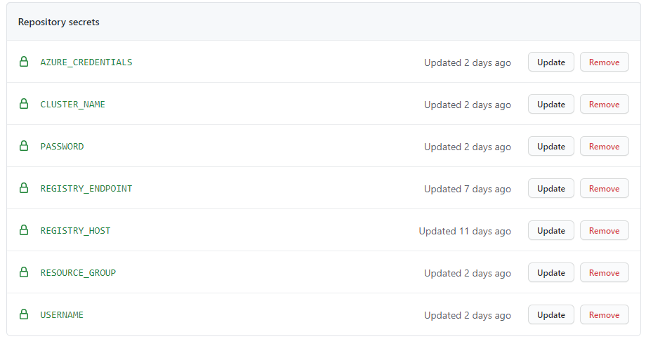
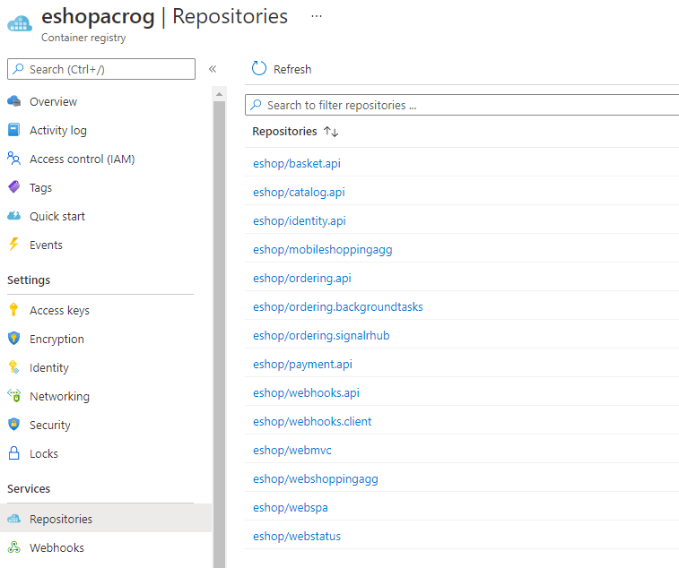
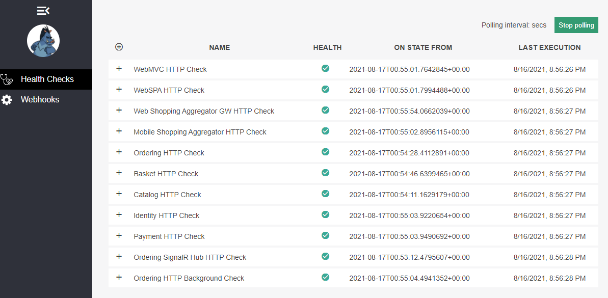

# Walkthrough of eShop setup on Azure Kubernetes Services and GitHub Actions

## Intro
The eShopOnContainers is a .NET core reference application from Microsoft to demonstrate microservices and container technologies. The project's Wiki contain different set of instructions to deploy the application on a local Kubernetes cluster or Azure Kubernetes Services (AKS) among different options.

Our goal in this tutorial is to setup a fully automated CI/CD deployment of this application using GitHub actions and AKS. The steps here are largely inspired and adapted from the main project documentation so I encourage you to read through the Wiki for further documentation and other scenarios.

In this walkthrough our objectives are:
- Automatically build the eShop containers through GitHub Actions
- Publish our built images to a private Azure Container Repository
- Automatically deploy updated images to Azure Kubernetes Services whenever there is a code change
- We will use the container version of the different storage services (an alternative would be to use native Azure cloud services such as Azure SQL, Azure Redis, etc.)

Pre-requisites
- You will need a GitHub account to fork the eShopOnContainers repository
- You will need an Azure account and subscription
- We will setup everything using the Azure Cloud Shell so you don't have any tools to install locally

WARNING: by creating the Azure resources in this walkthrough you will incur some costs. The exact cost will depend on the size of node instance you use as well as if you let the AKS cluster run 24/7 or not. If you simply create and then destroy everyting after the test in the same day you should not incur more than a few dollars of Azure costs.

## Clone project in Cloud Shell
First you will need to create a fork of the [eShopOnContainers](https://github.com/dotnet-architecture/eShopOnContainers) GitHub project so you can have your own version of the project to enable the GitHub actions. Or you can start from [my fork](https://github.com/oliviergaumond/eShopOnContainers) which already contain some fixes and enhancements to some scripts

You should login in your Azure Cloud Shell and clone your repo in the cloudrive folder
```
cd clouddrive
git clone <url of your repo>
```

## Create the Azure resources
Now we will create the necessary Azure resources to run the application. We need a Resource Group, an Azure Container Registry and an AKS cluster. We will also create a Azure AD Service principal so that GitHub actions can push images to our registry and deploy resources in AKS. See the warning above about costs you will incur for thoses resources

You should set the first 5 variables for the name of your resources and AKS node VM size.
Note: the ACR name needs to be unique across Azure. It should only contain alphanumeric characters (no dot or dash).

You can then copy and paste the full script below to run it in the Azure Cloud Shell.
```
export rg="<name your resource group>"
export acr="<name your registry>"
export aks="<name your cluster>"
export spnName="<name the service principal>"
export vmSize="Standard_B2ms"

# create resource group
az group create -n $rg --location eastus

# create ACR
az acr create -g $rg -n $acr --sku Basic --admin-enabled false
export acrId=$(az acr show -g $rg -n $acr --query "id" -o tsv)
export acrHost=$(az acr show -g $rg -n $acr --query "loginServer" -o tsv)

spnPassword=$(az ad sp create-for-rbac --name $spnName --scopes $acrId --role acrpush --query password --output tsv)
spnId=$(az ad sp list --display-name $spnName --query [].appId --output tsv)

#Create the Kubernetes cluster
az aks create -g $rg -n $aks --node-count 1 --node-vm-size $vmSize  --enable-addons monitoring,http_application_routing --generate-ssh-keys --attach-acr $acr

#Assign Azure Kubernetes Service Cluster Admin Role to the Service Principal
spnObjId=$(az ad sp list --display-name $spnName --query [].objectId --output tsv)
aksId=$(az aks show -g $rg -n $aks --query "id" -o tsv)
az role assignment create --assignee-object-id $spnObjId --role "Azure Kubernetes Service Cluster Admin Role" --scope $aksId

#Add the AKS credentials to local kubectl config file
az aks get-credentials --resource-group $rg --name $aks
```

## Configure GitHub secrets
We now need to create a few secrets in GitHub to configure the build and deploy pipelines.

Most of the values needed were stored in variables from the previous script. You can print them in your shell. You can also not these values and in particular the password in a safe place, because you won't be able to retrieve them once you close your Clous Shell.
```
echo $acrHost
echo $spnId
echo $spnPassword
echo $rg
echo $aks
```

Go to the Repository settings in GitHub and create each of these secrets.
REGISTRY_HOST -> <value of $acrHost> 
REGISTRY_ENDPOINT -> <value of $acrHost>/eshop
USERNAME -> <value of $spnId>
PASSWORD -> <value of $spnPassword>
CLUSTER_NAME -> <value of $aks>
RESOURCE_GROUP -> <value of $rg>
AZURE_CREDENTIALS -> { "clientId": "<value of $spnId>", "clientSecret": "<value of $spnPassword>", "tenantId": "<Azure tenant GUID>", "subscriptionId": "<Azure subscription ID>" }

The AZURE_CREDENTIALS secret is the one that will require the most manipulation, make sure to replace the proper values to form a valid JSON configuration. You can find your subscription and tenand ID from the Azure portal.

Once done you should have all your secrets configured


## Enable GitHub actions
Now that the Azure resources are ready we can enable the GitHub actions workflow and trigger a first build of all the images.

Go to GitHub Actions tab and enable the workflows


Manually run a workflow (basket-api)

Check the status of the workflow


If the build was successfull you should see the repository and image created in your Azure Container Registry

Trigger the build for all images by manually triggering all actions that don't start with 'deploy'. When all workflows have run successfully you should see a total of 14 repositories in your registry.


Note: in the original repository some of the workflow files didn't had the `workflow_dispatch` configuration to enable the manual trigger. I added these in my version, you can do the same.

## Pre-setup
Next we have some additionnal configurations to run on the AKS cluster before deploying the application.

Run these commands in your cloud shell. Make sure you are located at the root directory where you cloned the repository.
```
#create a namespace to deploy the application
kubectl create ns eshop

# deploy nginx controller
cd deploy/k8s/nginx-ingress
kubectl apply -f mandatory.yaml
kubectl apply -f local-cm.yaml
kubectl apply -f local-svc.yaml

# update nginx controller to allow large heaeders for login
cd -
cd deploy/k8s/helm
kubectl apply -f aks-httpaddon-cfg.yaml
kubectl delete pod $(kubectl get pod -l app=addon-http-application-routing-nginx-ingress -n kube-system -o jsonpath="{.items[0].metadata.name}") -n kube-system
```

## First deployment
Now we are ready to deploy the application from the image we built. 

Run the following script in your cloud shell.
```
cd -
cd deploy/k8s/helm
./deploy-all.sh --aks-name eshopaks-og --aks-rg eshop-rg --dns aks --app-name eshop --namespace eshop --tag linux-dev --skip-clean --registry $acrHost --docker-username $spnId --docker-password $spnPassword
```

NOTE: if you forked directly from the official repository you may see that the apigwms and apigwws are not deploying correctly. There is an issue with the script. You can use my version of the [deploy-all.sh script](https://github.com/oliviergaumond/eShopOnContainers/blob/dev/deploy/k8s/helm/deploy-all.sh) which is fixed.

## To test
You can find the external address of the cluster by listing the ingress resources in the namespace.

```
kubectl -n eshop get ingress
```

All the ingresses share the same hostname, just grab one and try it in your browser.
WebSPA: http://[eshop.<your-guid>.<region>.aksapp.io]/

You can also check the webstatus page
WebStatus: http://[eshop.<your-guid>.<region>.aksapp.io]/webstatus

It may take a few minutes for all services to start, but eventually the webstatus page should show all services as healthy


## Enable deployment
Now that the initial deployment is working correclty we can test the automatic deployment of a code change.

First we need to enable the deploy workflows in the GitHub Actions.

Uncomment this line in the *-deploy.yaml files in the `.github/workflows folder`
```
if: ${{ github.event_name == 'workflow_dispatch' || github.event_name == 'repository_dispatch' || github.event.workflow_run.conclusion == 'success' }}
```
And comment this line just below
```
 #if: false
```

Make sure to commit and push your changes.

## Test a change
We can now simultate a change in the code and push it and see it deploy automatically. There is pre-defined piece of code ready for that, you can see the instructions here
https://github.com/dotnet-architecture/eShopOnContainers/wiki/Deployment-With-GitHub-Actions#release-a-code-change


## Clean up
To clean up everything there are a few options.

You can uninstall all the helm packages from your AKS cluster. You can use this option if you want to keep the AKS cluster and re-install the application later
```
helm uninstall -n eshop $(helm ls -n eshop --filter eshop -q)
```

You can also simply delete the Kubernetes namespace and it will delete all resources deployed in that namespace.
```
kubectl delete ns eshop
```

The final option is to completely delete the Azure resource group. This is the only option that will delete everything and make sure you don't incur any more costs for the resources you created.
```
az group delete -n $rg
```

To entirely clean-up we should also delete the service principal we created
```
az ad sp delete --id $spnId
```


## References:
The instructions in this walkthrough were inspired from the documentation in the original project Wiki. Those pages in particular contain most of the steps described here
- Deploying eShop to Azure Kubernetes Services (https://github.com/dotnet-architecture/eShopOnContainers/wiki/Deploy-to-Azure-Kubernetes-Service-(AKS))
- Setting up the image build with GitHub Actions:  (https://github.com/dotnet-architecture/eShopOnContainers/wiki/GitHub-Actions)
- Setting up the image deployment with GitHub Actions (https://github.com/dotnet-architecture/eShopOnContainers/wiki/Deployment-With-GitHub-Actions)

## Final words
