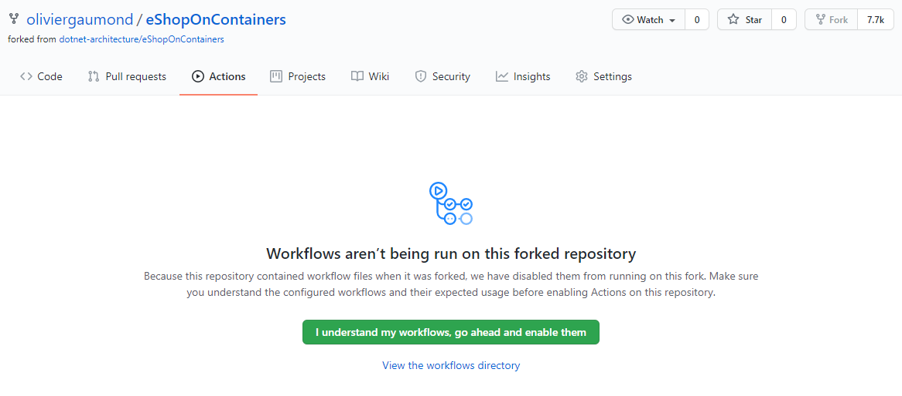
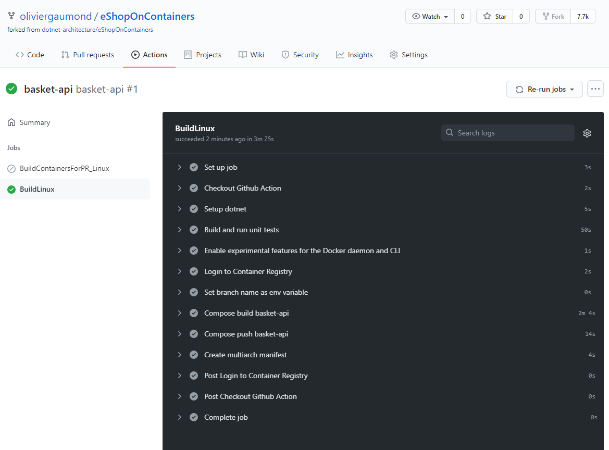

# CI/CD setup with GitHub Actions


Create resource group and ACR

Note: the ACR name needs to be unique across Azure. It should only contain alphanumeric caracters.

```
export rg="eshop-rg"
export acr="eshopacrog"
export spnName="eshopacr-spn"


# create RG
az group create -n $rg --location eastus

# create ACR

#TODO verify if admin enabled is required
az acr create -g $rg -n $acr --sku Basic --admin-enabled true
export acrId=$(az acr show -g $rg -n $acr --query "id" -o tsv)
export acrHost=$(az acr show -g $rg -n $acr --query "loginServer" -o tsv)

spnPassword=$(az ad sp create-for-rbac --name http://$spnName --scopes $acrId --role acrpush --query password --output tsv)

#TODO error finding service principal
spnId=$(az ad sp show --display-name http://$spnName --query appId --output tsv)
```

az ad sp list --display-name http://eshopacr-spn
az ad sp show --id 22424529-05a4-4a6f-9336-b61a52157342 --query appId --output tsv

Find the appId and password from Service Principal and create GitHub secrets

REGISTRY_HOST -> acrHost
REGISTRY_ENDPOINT -> $acrHost/eshop ???
USERNAME -> spnId
PASSWORD -> spnPassword

Go to GitHub Actions tab and enable the workflows



Manually run a workflow (basket-api)

Check the status of the workflow


If the build was successfull you should see the repository and image created in your Azure Container Registry

Questions
- Why not all yaml file have a workflow_dispatch?
- Difference between REGISTRY_ENDPOINT and REGISTRY_HOST (OK)